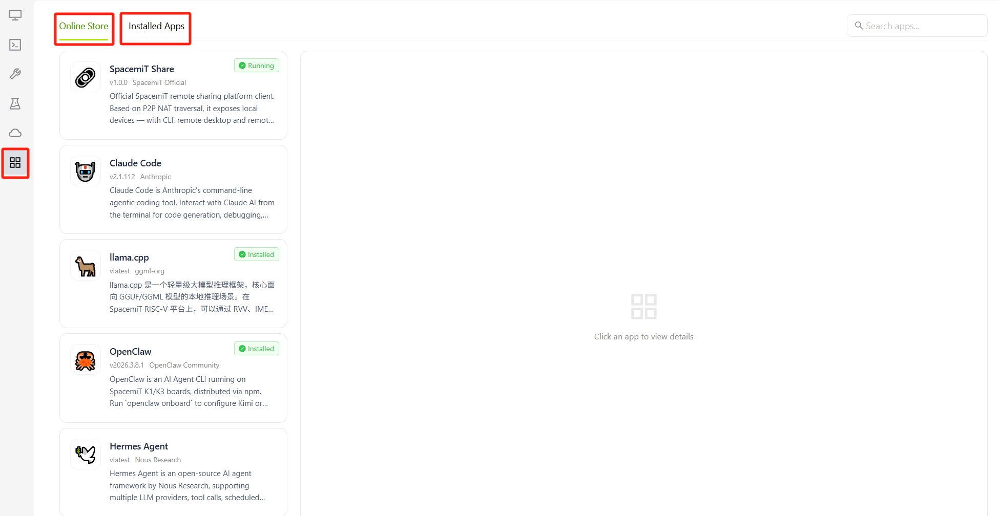
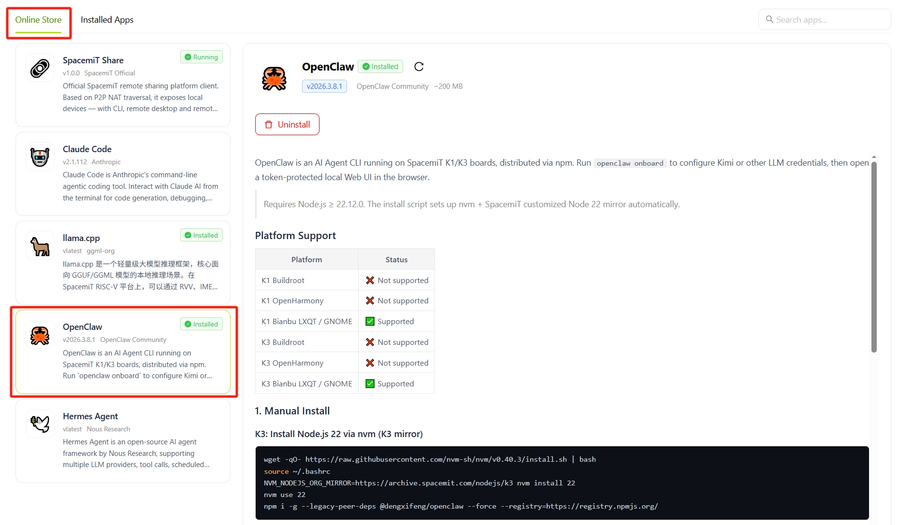
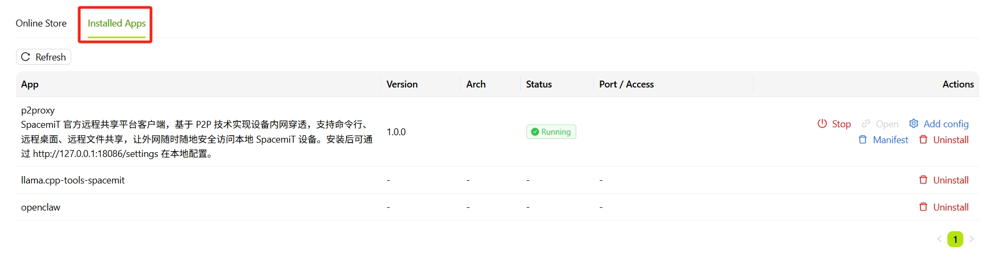

# App Center

## Overview

App Center supports the browsing, installation, and management of applications and tools for the SpacemiT platform. It is organized into the **Online Store** and **Installed Apps** pages.

## Online Store

The Online Store displays all available applications in the ecosystem.

A search box in the upper-right corner enables apps to be located by name.

Each app card displays the following information:

- App name and version
- Publisher
- Summary
- Installation status, such as **Installed** or **Running**

Selecting an app card displays its details in the panel on the right, including:

- App icon, name, and current status, such as **Running**
- Version, publisher, and package size
- Action buttons: **Open** / **Uninstall** for installed apps, or **Install to device** for apps that are not installed
- Complete feature description
- Supported systems and architectures

## Installed Apps

The Installed Apps page lists and manages all applications currently installed on the device.

Select **Refresh** to retrieve the latest status for each app.

The list contains the following columns:

- **App**: App name and summary
- **Version**: Currently installed version
- **Architecture**: Runtime architecture
- **Status**: Runtime status, such as **Running**, **Installed**
- **Port / Access**: Service listening port or access point
- **Actions**: Actions available for the app

The available actions for each app depend on its running status:

- **Stop**: Stop a running app
- **Open**: Access the app in a browser or window
- **Config**: Modify the app configuration
- **Default**: Restore the default configuration
- **Uninstall**: Remove the app from the device