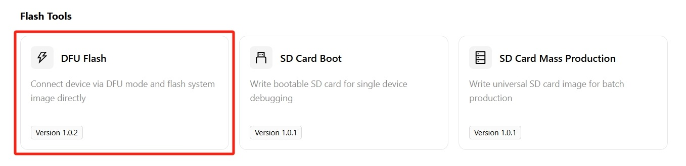
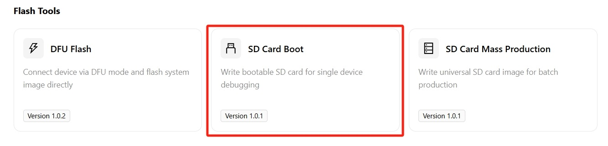
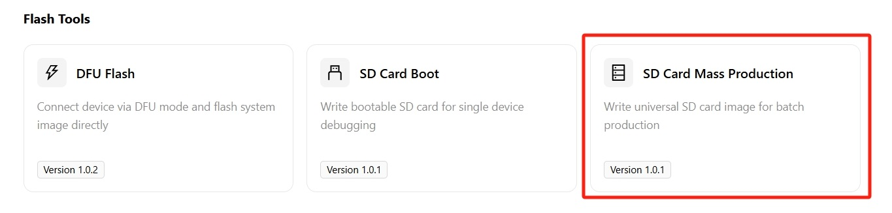
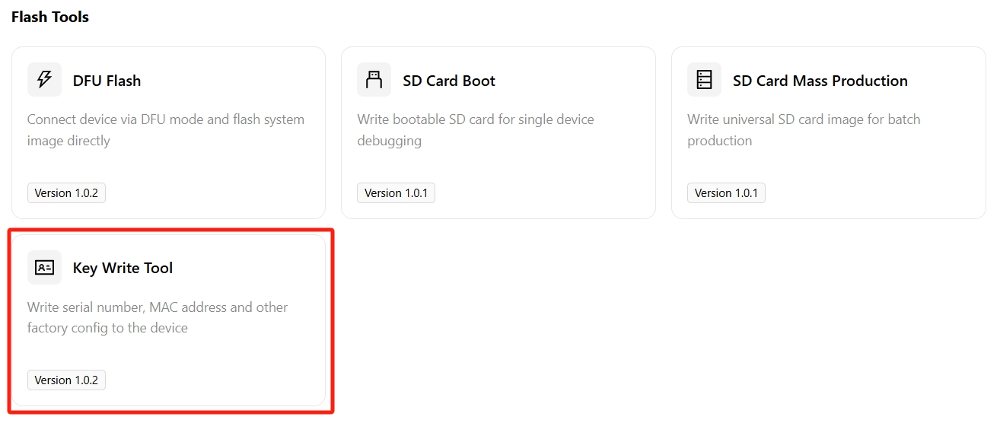
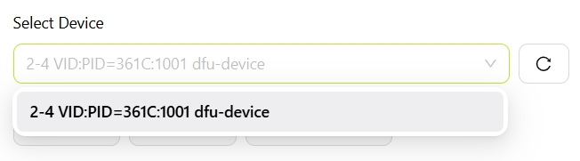
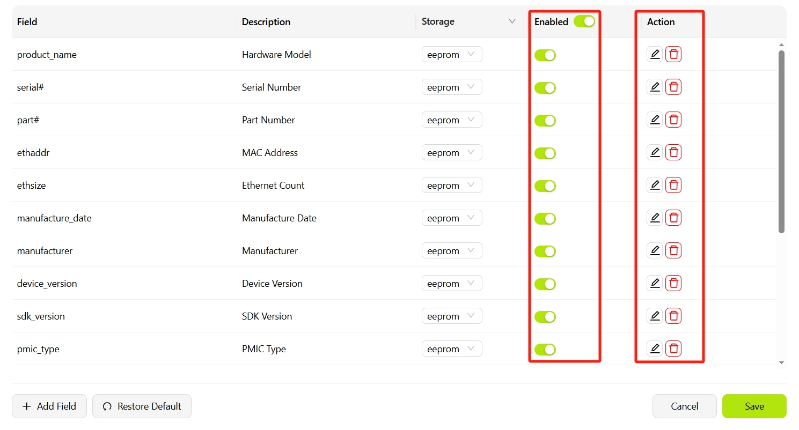
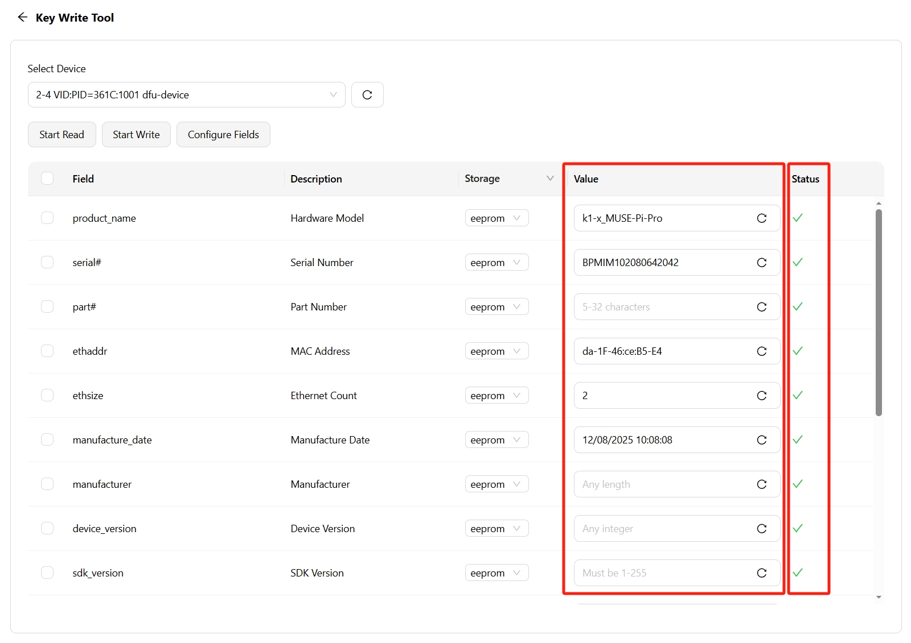

# Flash Tools

## DFU Flash

Writes a system image directly to the device's onboard storage in USB DFU mode. Suitable for installing or updating the system on a single device.

### Prerequisites

- The SpacemiT Studio driver for the target platform is installed. See [Quick Start](../../quick_start.md).
- The device is connected to the computer via a USB cable.
- The device has entered flashing mode.

The procedure for entering flashing mode differs by model. Refer to the applicable user guide:

| Series | Model | User Guide |
| ---- | ----------- | -------------------- |
| K1 | MUSE Pi Pro | [User Guide](https://www.spacemit.com/community/document/info?lang=en&nodepath=hardware/eco/k1_muse_pi_pro/pi_pro_user_guide.md) |
| K1 | MUSE Pi | [User Guide](https://www.spacemit.com/community/document/info?lang=en&nodepath=hardware/eco/k1_muse_pi/pi_user_guide.md) |
| K1 | MUSE Book | [User Guide](https://www.spacemit.com/community/document/info?lang=en&nodepath=hardware/eco/k1_muse_book/book_user_guide.md) |
| K1 | MUSE Paper | [User Guide](https://www.spacemit.com/community/document/info?lang=en&nodepath=hardware/eco/k1_muse_paper/paper_user_guide.md) |
| K3 | CoM260 Kit | [User Guide](https://www.spacemit.com/community/document/info?lang=en&nodepath=hardware/eco/k3_com260/com260_user_guide.md) |
| K3 | Pico-ITX | [User Guide](https://www.spacemit.com/community/document/info?lang=en&nodepath=hardware/eco/k3_pico/root_overview.md) |

### Procedure

1. Go to **Development Tools → DFU Flash**.

   

2. The tool automatically detects connected devices in flashing mode. If the device is not detected, verify that it meets the [prerequisites](#prerequisites).

   

   If multiple devices are connected, use the **Select Device** drop-down to choose the target device.

   

3. Select and download a system image.

   Click **More** to open the image library.

   

   In the image library, select the target image:

   

   (1) Select the board series (K1 or K3).  
   (2) Select the target OS (Bianbu, Buildroot, ROS2, or OpenHarmony).  
   (3) Select the OS version.  
   (4) Select a specific image and click **Download**.

   Image download in progress:

   

   Image download complete:

   

   Click **Local** to view previously downloaded images. To use an image file already on the computer, click **Upload Local Image**:

   

   Return to the DFU Flash screen and select the downloaded image from the **Select Image** drop-down:

   

4. Click **Start Flash**.

   Confirm the settings (**Reboot after flashing** is selected by default), then click **Start Flash**.

   

   Flashing begins and progress is displayed:

   

5. Wait for flashing to complete.

   If flashing succeeds and **Reboot after flashing** is selected, the device restarts automatically.

   

   If flashing fails, an error message is displayed:

   

### Advanced Options: Configure Partitions

To use custom partition configuration files, select **Partitions Config**:

Click **Edit Files** to open **Partition Files**:

In **Partition Files**, add, remove, or modify partition configuration files. Click **Confirm** to return to the DFU Flash screen.

## SD Card Boot

Writes a system image to an SD card, allowing the device to boot from the card. Suitable for debugging a single device or evaluating a new OS without modifying the device's onboard storage.

### SD Card Boot Prerequisites

- The SD card is inserted into a card reader connected to the computer.
- The SD card capacity is greater than or equal to the image size.

### SD Card Boot Procedure

1. Go to **Development Tools → SD Card Boot**.

   

2. Select the target SD card from the **Select Device** drop-down.

   

   > If the list is empty, confirm the SD card is inserted and click the refresh button ⟳ to re-detect.

3. **Flash Boot Card** is selected by default under **Select Operation**.

   > **Optional:** Select **Format SD** to format the SD card only, without writing an image.
   >
   > 
   >
   > 
   >
   > 

4. Select the target image.

   - If no image has been downloaded, click **More** to browse and download one.
   - If an image is already available, select it from the **Select Image** drop-down.

5. Click **Execute** and wait for the image write to complete.

   Writing the boot card:

   

   Boot card creation complete:

   

6. After writing is complete, insert the SD card into the device and power on to boot from the SD card.

## SD Card Mass Production

Creates SD cards for mass production. After a production image is written to an SD card and the card is inserted into a target device, powering on the device automatically installs the system to onboard storage without manual intervention.

### SD Card Mass Production Prerequisites

- The SD card is inserted into a card reader connected to the computer.
- The SD card capacity is greater than or equal to the image size.

### SD Card Mass Production Procedure

The procedure is the same as [SD Card Boot](#sd-card-boot), with the following differences:

- In step 1, go to **Development Tools → SD Card Mass Production**.
  
- In step 3 under **Select Operation**, select **Flash Mass Production Card**.
  
- After step 6, insert the SD card into a target device. On power-up, the device automatically writes the system from the SD card to onboard storage.

### Comparison: SD Card Boot vs. Mass Production

| | SD Card Boot | SD Card Mass Production |
| ------ | --------- | --------- |
| System storage location | SD card | Device onboard storage |
| Behavior after SD card removal | Cannot boot | Operates normally |
| Typical use case | Debugging, evaluation | Mass production |

## Writing Tool

Writes factory configuration information, such as serial numbers and MAC addresses, to a device. Use it for production-line configuration or to verify information on an individual device.

### Writing Tool Procedure

1. Go to **Development Tools → Key Writing Tool**.

   

2. Select the target device.

   In the **Select Device** drop-down list, select the device to configure.

   

   > If the list is empty, confirm that the device is connected and in flashing mode, then click the refresh button ⟳ on the right to scan again.

3. (Optional) Configure fields.

   To customize the fields displayed in the table, click **Configure Fields** to open the field configuration panel. In the panel, you can:

   

   - Use the **Enabled** switch to control whether a field is shown in the table.
   - Click the edit icon **✎** to change a field's description or storage medium.
   - Click the delete icon **🗑** icon to remove a field.
   - Click **Add Field** to add a custom field.
   - Click **Restore Default** to restore the default field list.

   Click **Save** to apply the changes, or **Cancel** to discard them.

4. Read the current device configuration.

   Click **Start Reading**. The tool reads all configuration fields from the device and fills the table.

   

   After the read operation completes, the table displays the following columns:

   - **Property**: Technical identifier for the field, such as `product_name` or `serial#`.
   - **Description**: Readable description of the field.
   - **Storage Medium**: Storage location; `eeprom` is the default.
   - **Value**: Current value stored on the device.
   - **Status**: Result of the read operation, showing success (✓) or failure (✗).

   Common fields include the hardware board model, device serial number, MAC address, and manufacturing date. The refresh button ⟳ beside each field reads that field again.

5. Edit and write configuration.

   Edit the required values in the **Value** column, select the check box for each field to write, then click **Start Writing**.

   After the write operation completes, the **Status** column shows the result for each field.

   > After writing, click **Start Reading** again to verify that the configuration was written correctly.
