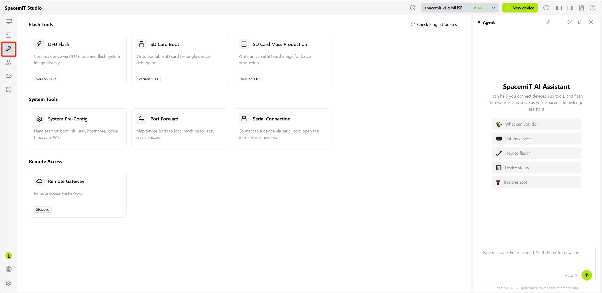

# Development Tools

The Development Tools page provides three categories of tools: Flash Tools, System Tools, and Remote Access. These tools support common operations from image writing to device configuration and remote access.

- [Flash Tools](./flash.md):
  DFU flashing, SD card boot, and SD card mass production

- [System Tools](./system_tools.md):
  System preconfiguration, port forwarding, and serial connection

- [Remote Gateway](./remote_access.md):
  Cross-network device access through P2Proxy gateway
