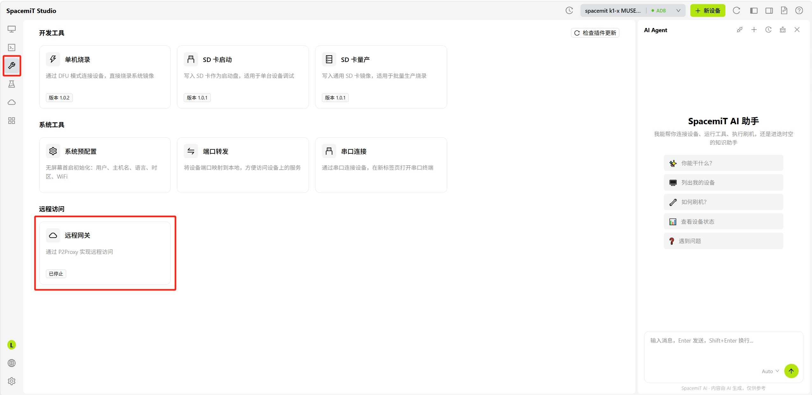
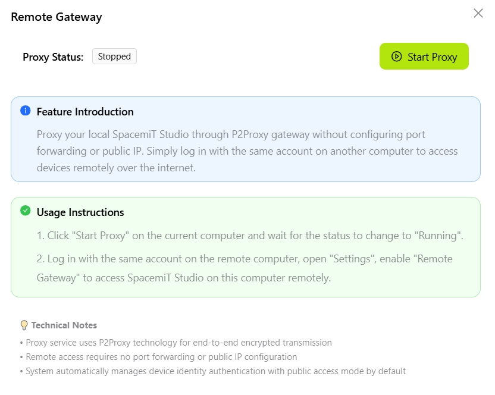
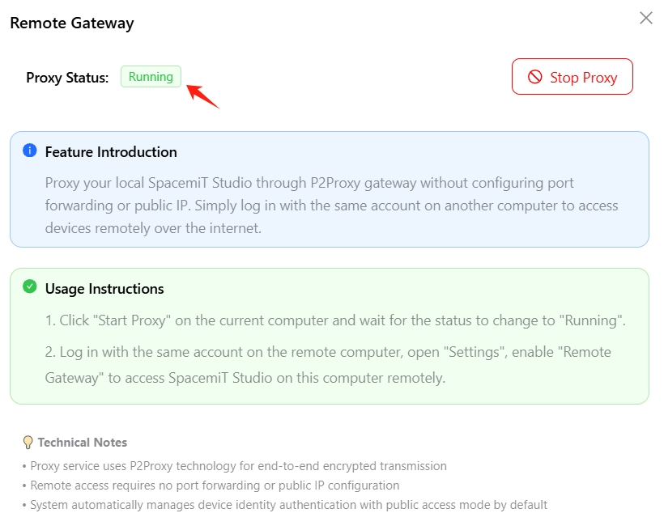
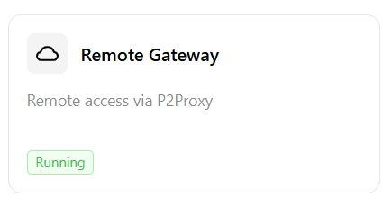

# Remote Gateway

Remote Gateway lets you access SpacemiT Studio and connected devices on another computer — no public IP or port forwarding needed.

## How It Works

Think of it like this: **Computer A** (the one with your devices) starts a proxy service, and **Computer B** (your remote computer) connects to it through your account.

## Setup Guide

### Step 1: Start the Proxy on Computer A (Host)

1. Open the **Development Tools** page and find the **Remote Access** section
   

2. Click the **Remote Gateway** card to open the settings dialog
   

3. Click **Start Proxy**

4. Wait for the status to change to **Running**
   

   The **Remote Gateway** card status will also update to **Running**
   

   > Computer A is now ready to accept remote connections.

### Step 2: Connect from Computer B (Remote)

1. Open SpacemiT Studio on Computer B
2. Log in using the **same account** as Computer A
3. Click the **Settings** icon (lower-left corner)
4. Find **Remote Gateway** and turn it on
   

5. You're connected! You can now access Studio and devices on Computer A

## Troubleshooting

**Connection fails?**

- Make sure both computers are logged into the same account
- Check that the proxy status on Computer A shows "Running"
- Verify both computers have internet access

**Slow connection?**

- Check your network speed and latency
- Try restarting the proxy service on Computer A
