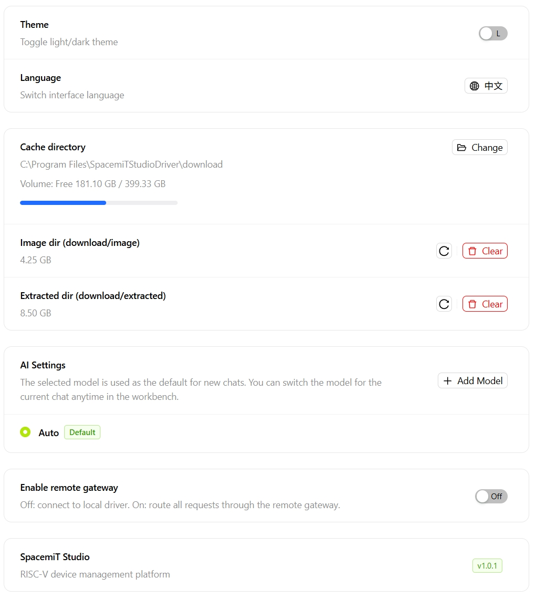
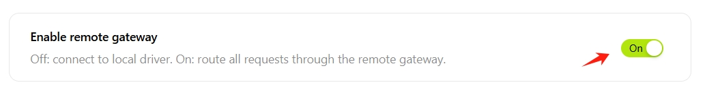

# Settings

Click the ⚙️ icon to open the Settings page, where the appearance, cache, AI models, and Remote Device Sharing for SpacemiT Studio can be configured.

## Appearance

- **Theme Mode**: Switches between light and dark themes.
- **Language**: Switches the interface language (Chinese/English).

## Cache Management

- **Cache Directory**: Click **Change** to modify the default download and storage path. A non-system drive is recommended.
- **Image Directory**: Click **Clear** to delete downloaded raw image files. Deleted image files must be downloaded again before use.
- **Extraction Directory**: Click **Clear** to delete extracted files. Before clearing, verify that no active projects still depend on this directory.

## AI Settings

- **Add Model**: Click **+ Add Model**, fill in the following information, then click **OK**:
  
  - **Name**: A custom display name for the model.
  - **Provider**: The model service provider (such as OpenAI or ByteDance).
  - **API Key**: The key used for authentication.
  - **Model ID**: The identifier used to invoke the model (such as `gpt-4o` or `doubao-seed-1-6`).
  - **Max Tokens**: The maximum number of tokens allowed per request. Leave blank to use the provider's default value.

## Remote Device Sharing

The Remote Device Sharing feature allows users to remotely access SpacemiT Studio on other computers.

- **Disabled (default)**: Access local devices only
- **Enabled**: When enabled, allows remote access to Studio and connected devices on other computers under the same account

> Before using the Remote Device Sharing, the proxy service must be started on the host computer from the [Development Tools -> Remote Access](./dev_tools/remote_access.md) page.

## About

Displays the current SpacemiT Studio version.
