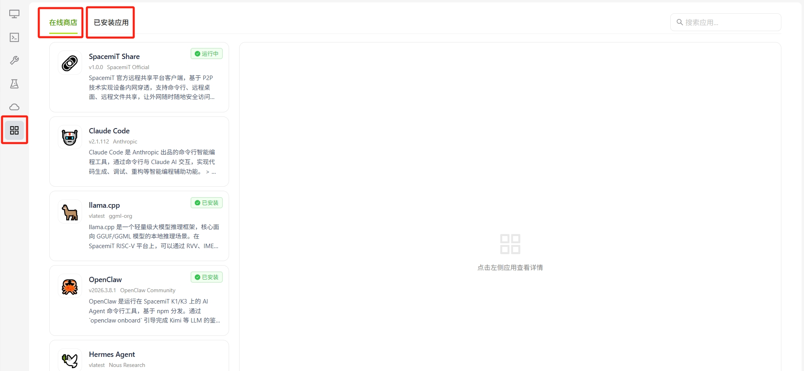
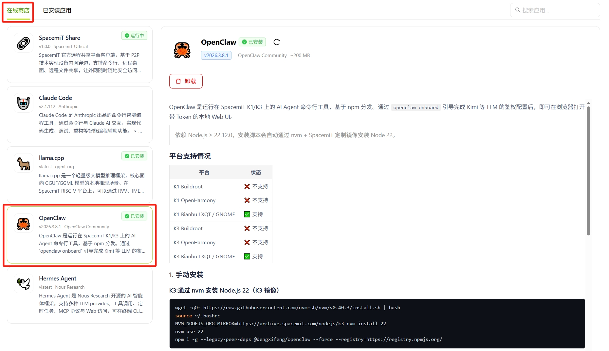
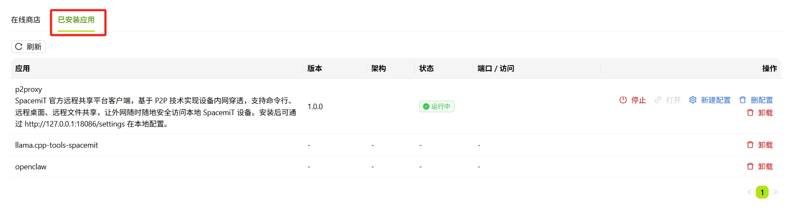

# 应用中心

## 概述

应用中心提供适配 SpacemiT 平台的应用和工具的浏览、安装与管理功能，分为 **在线商店** 和 **已安装应用** 两个页面。

## 在线商店

在线商店展示所有可用的生态应用。

界面右上角提供搜索框，可按应用名称快速定位。

每个应用卡片显示以下信息：

- 应用名称与版本
- 发布者
- 简介摘要
- 安装状态（如 **已安装**、**运行中**）

点击应用卡片后，右侧面板显示该应用的详情，包括：

- 应用图标、名称、当前运行状态（如 **运行中**）
- 版本、发布者、包大小
- 操作按钮：**打开** / **卸载**（已安装应用）或 **安装到设备**（未安装应用）
- 完整功能描述
- 支持的系统和系统

## 已安装应用

已安装应用页面以列表形式管理当前设备上的所有已安装应用。

点击 **⟳ 刷新** 可重新获取各应用的最新状态。

列表包含以下列：

- **应用**：应用名称与简介
- **版本**：当前安装版本
- **架构**：运行架构
- **状态**：运行状态（如 **运行中**，**已安装**）
- **端口 / 访问**：服务监听端口或访问入口
- **操作**：可对该应用执行的操作

每个应用的可用操作视运行状态而定：

- **停止**：停止正在运行的应用
- **打开**：在浏览器或窗口中访问应用
- **配置**：修改应用配置
- **默认配置**：恢复默认配置
- **卸载**：从设备卸载该应用
