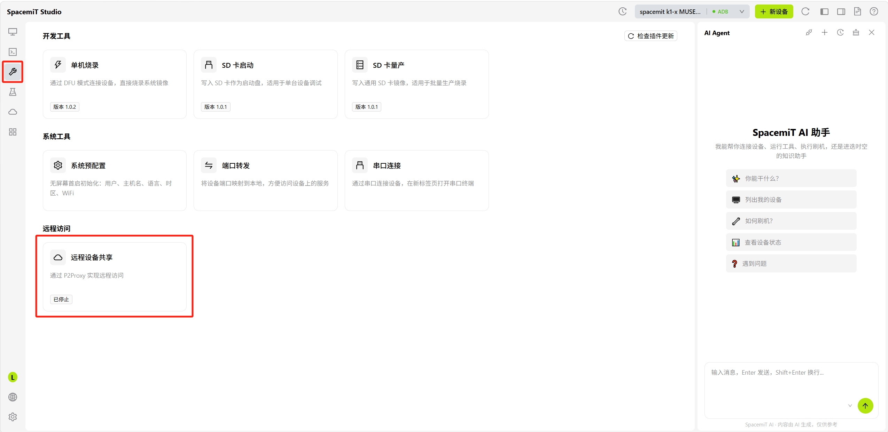
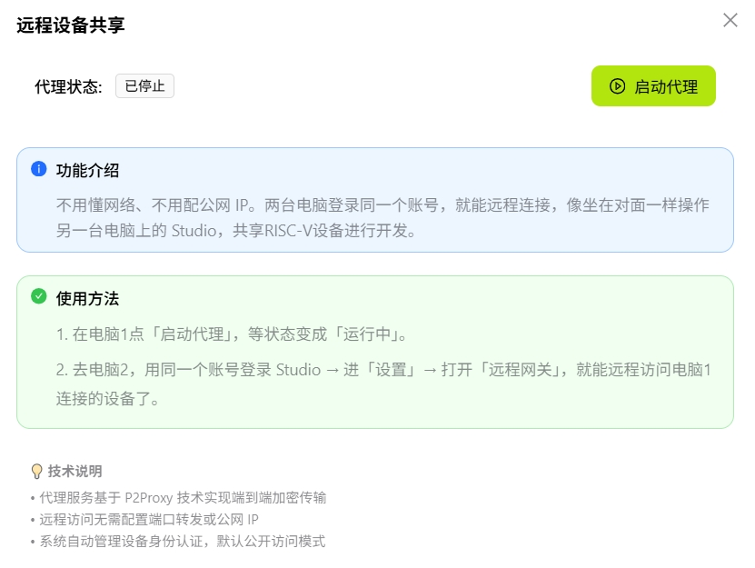
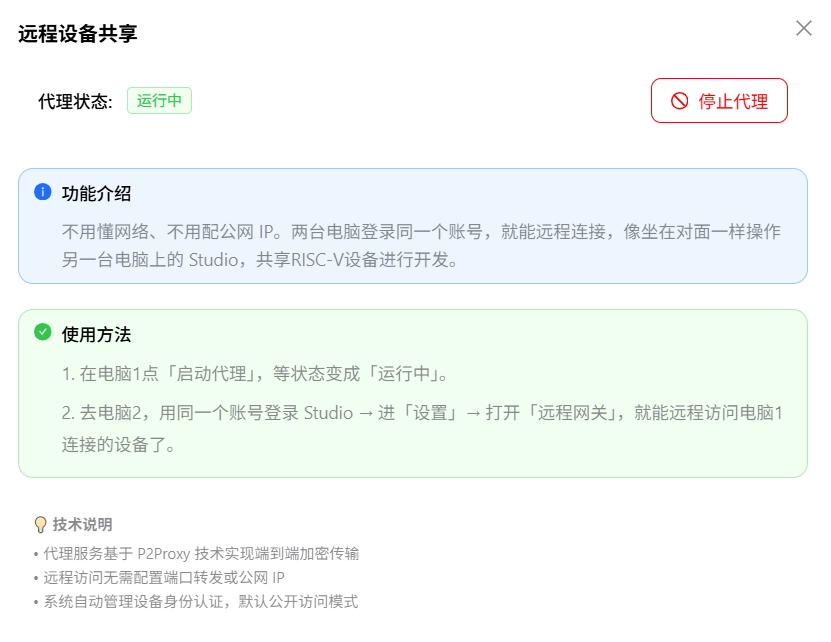
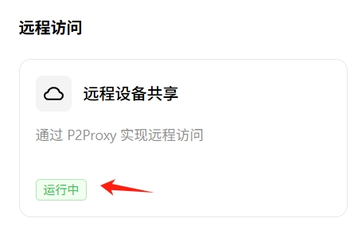

# 远程设备共享

远程设备共享功能允许用户在未配置公网 IP 或端口转发的情况下，从另一台电脑远程访问当前电脑上的 SpacemiT Studio 和已连接的设备。

## 使用步骤

### 第 1 步：在当前电脑（电脑 A）启动代理

1. 打开**开发工具**页面，找到**远程访问**类别
   

2. 点击**远程设备共享**卡片，打开配置弹窗
   

3. 点击**启动代理**按钮

4. 等待代理状态变为**运行中**
    

   **远程设备共享**卡片状态也同步变为**运行中**
    

   > 代理启动后，当前电脑将作为主机端等待远程访问。

### 第 2 步：在远程电脑（电脑 B）启用访问

1. 在另一台电脑上打开 SpacemiT Studio
2. 使用**相同账号**登录
3. 点击左下角**设置**图标
4. 找到**启用远程设备共享**选项并启用
    

5. 启用后，即可访问主机端电脑（电脑 A）上的 Studio 和设备

## 常见问题

**Q：远程设备共享连接失败？**

- 确认两台电脑都已登录相同账号
- 检查代理状态是否为「运行中」
- 确认网络连接正常

**Q：远程访问速度慢？**

- 检查网络带宽和延迟
- 尝试重新启动代理服务
