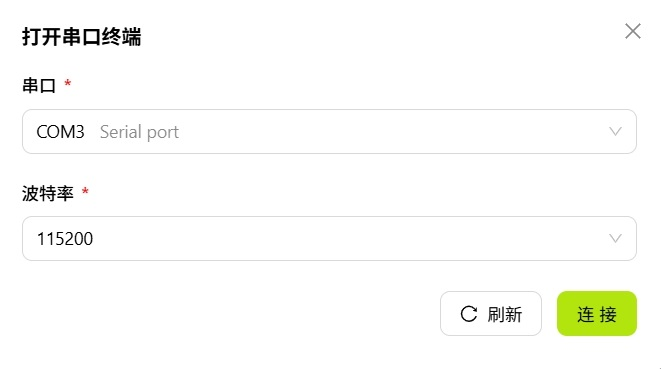
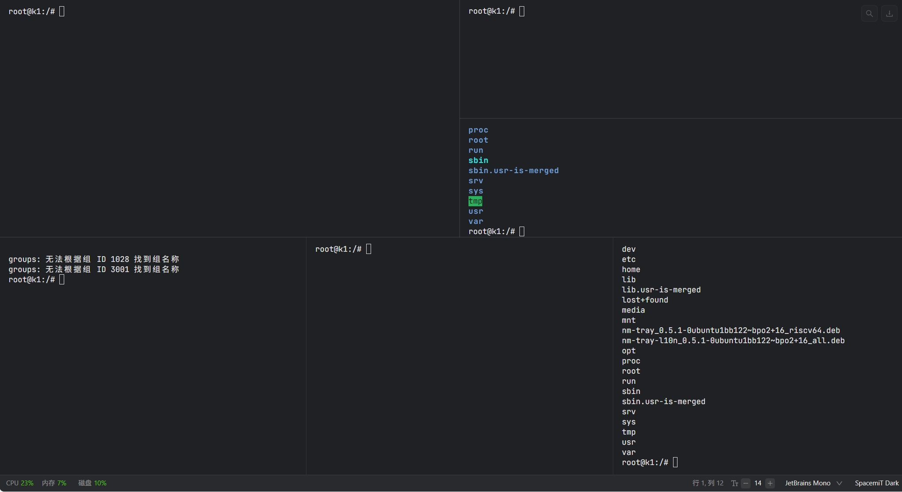

# 终端面板

终端面板提供集成的命令行环境，支持通过 SSH 或串口与设备交互，无需切换到外部终端工具。

> 注：设备需已经连接

## 文件管理

左侧的文件管理面板提供设备文件系统浏览能力。

### 工具栏

面板顶部工具栏提供常用操作按钮：

- **刷新**：刷新当前目录
- **新建文件夹**：在当前目录下新建文件夹
- **上传文件**：将本地文件上传到当前目录
- **下载文件**：将所选文件下载到本地

### 上下文菜单

在文件或目录上右键可弹出上下文菜单，提供以下操作：

- **复制路径**：复制所选文件或文件夹的路径
- **在此启动终端**：在所选目录位置打开新的终端会话
- **重命名**：重命名所选文件或文件夹
- **删除**：删除所选文件或文件夹

## 终端会话

右侧的终端会话区域提供命令行环境，支持多标签，每个标签对应一个独立会话。

### 工具栏

终端顶部工具栏包含以下操作：

- **+**：新建终端标签

- **SSH**：通过 SSH 连接设备，打开远程终端。点击后弹出配置窗口，填写 SSH 端口、用户名和密码后即可连接
  

- **ADB**：通过 ADB 协议连接设备，打开调试 shell。

- **打开串口**：打开串口终端，用于查看启动日志和底层调试。点击后弹出配置窗口，选择串口设备并设置波特率等参数后连接
  

- **左右分屏**：水平分割终端区域，在左右两侧创建独立的终端面板
  
- **上下分屏**：垂直分割终端区域，在上下两部分创建独立的终端面板

  > **分屏限制：** 单个方向最多支持 5 个分屏，全局最多支持 16 个终端面板。

- **全屏**：将终端区域切换为全屏模式
